# procedural-art-triangle-placement
Procedural placement of transparent triangles to resemble target painting.

The mean squared error between drawing and target painting is minimized through gradient free optimizers such as Differential Evolution (DE) and Parameter-exploring Policy Gradients (PGPE) with clipped updates (ClipUp).
 

#### Table 1. Best solution obtained with DE is used to initialize the center of the PGPE. Target and optimized image resolutions are 400x400. Target and optimized images resolutions are 400x400. 
Target |                      DE (1k ite.)                       |              PGPE with ClipUp (10k ite.)               
:----:|:-------------------------------------------------------:|:-------------------------------------------------------------:
 |   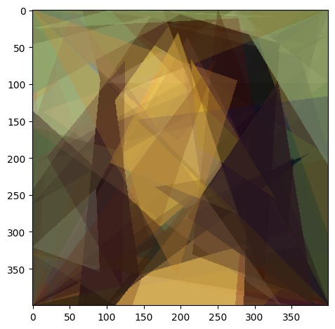   |     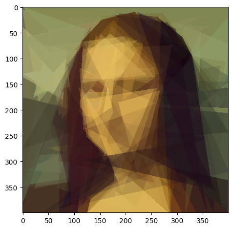     |
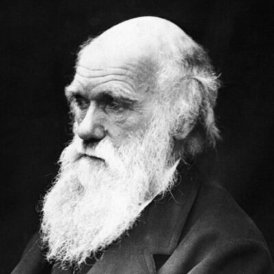 |  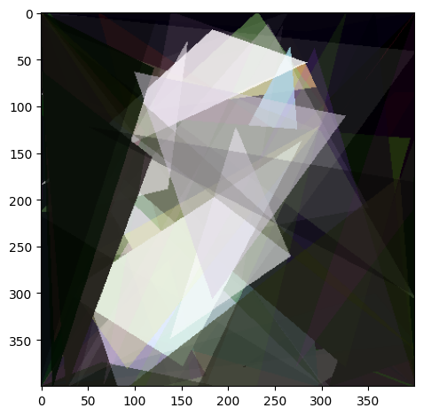  |    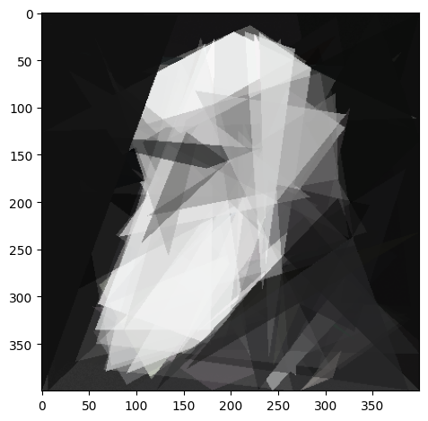    |
 | 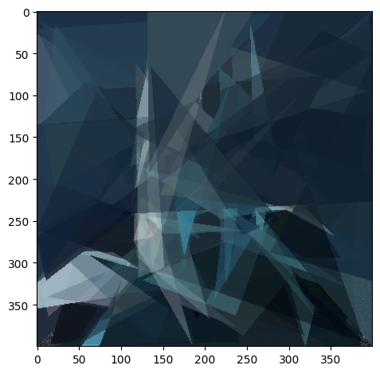 |      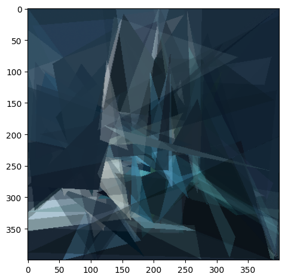      |

#### Table 2. Images generated with 10k DE and 40k PGPE iterations. Resulting images rendered in 4k resolution.
Target |                              4k resulting image                                             
:----:|:------------------------------------------------------------
 |     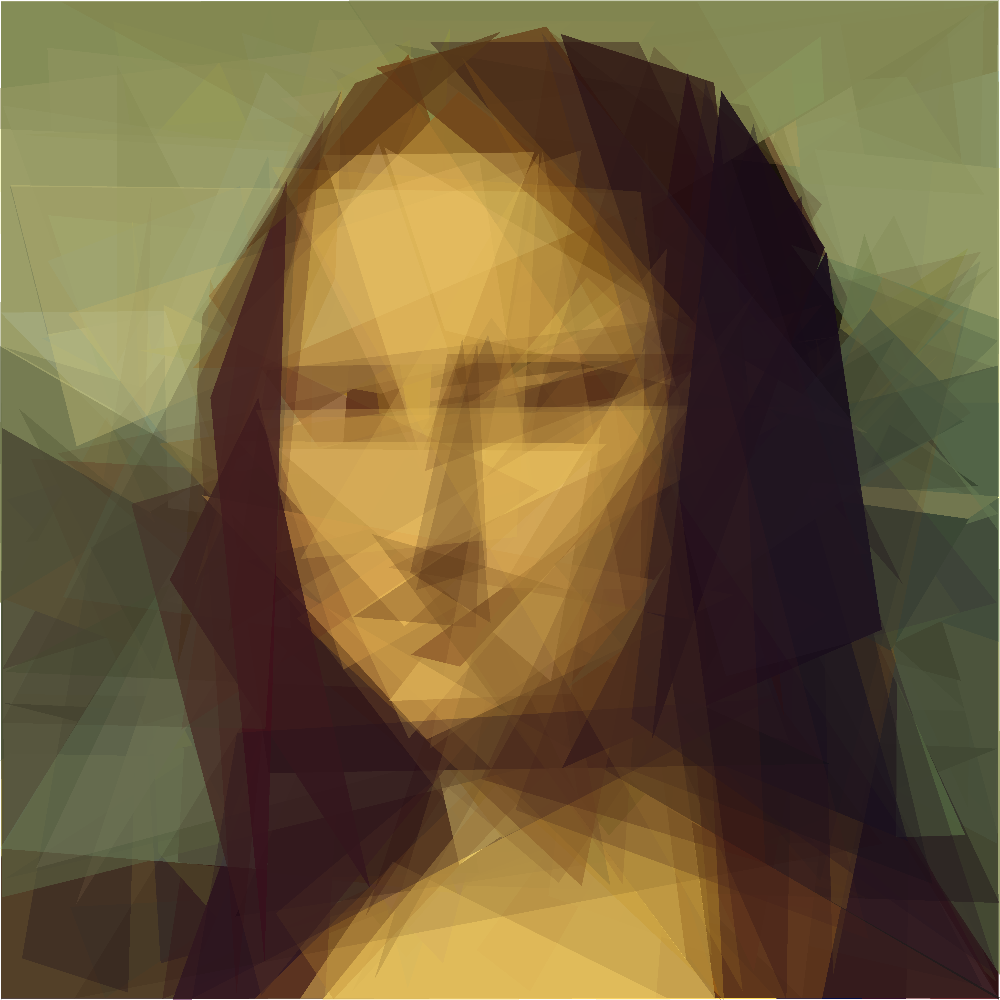      
 |     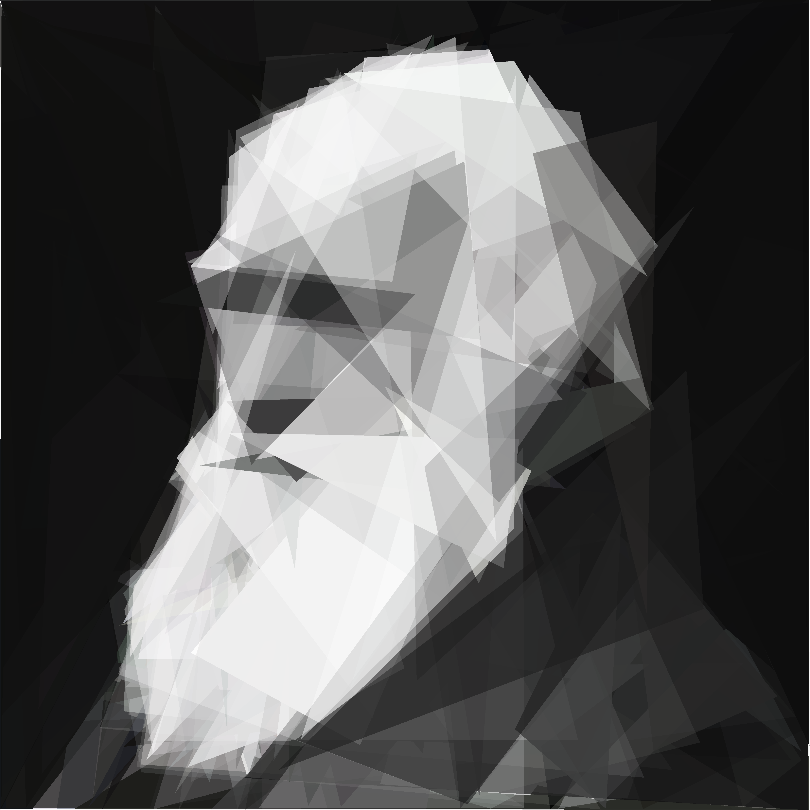
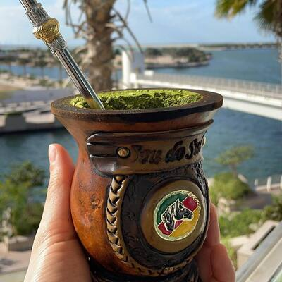 |     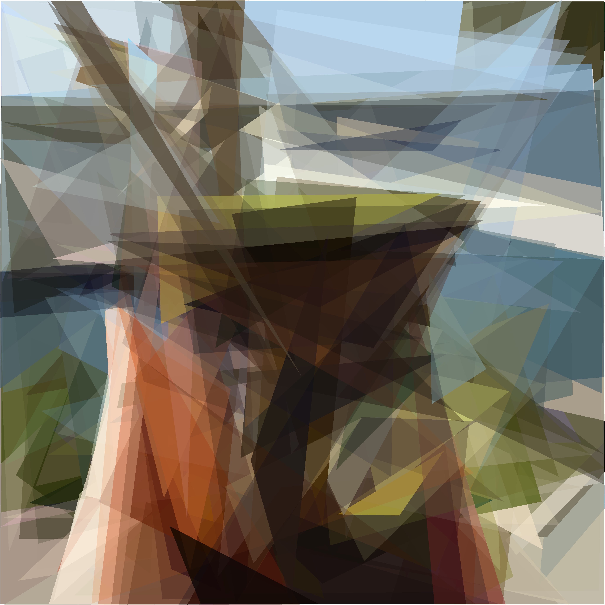

