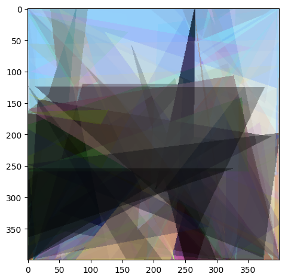
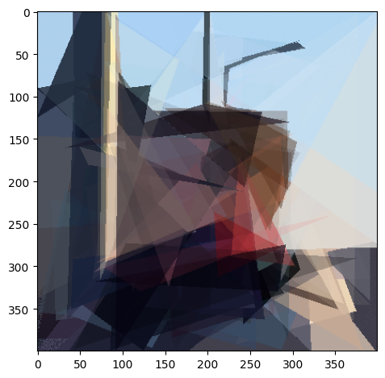

# procedural-art-triangle-placement
Procedural placement of transparent triangles to resemble target painting.

The mean squared error between drawing and target painting is minimized through gradient free optimizers such as Differential Evolution (DE) and Parameter-exploring Policy Gradients (PGPE) with clipped updates (ClipUp).
 
 

### Table 1. Target and painted images with 100 triangles. 
Target |                              DE                              |              DE center init. + PGPE with ClipUp               
:----:|:------------------------------------------------------------:|:-------------------------------------------------------------:
 |           |          |
 |         |        |
 |       |            |
 |  |  |